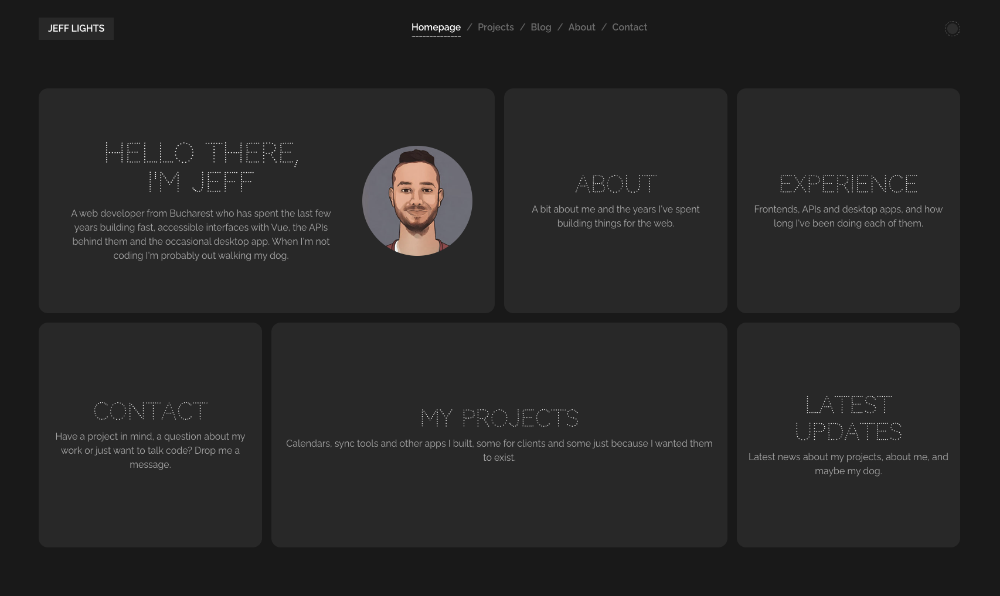

# Jeff Lights

Here's some stupid old project in the graveyard of GitHub so I can clean my backup drives of sentimental crap. More useless stuff to come, stay tuned.



## Why it exists

I built this when I was learning Vue. No course, no tutorial series, I just picked something I could keep adding to and every time I figured out something new it ended up in here. Modals that open from the URL so the back button closes them? In. Remember that weird outline glow effect Windows 10 had for a while? In. Three color themes nobody asked for? Obviously in. The pink one is #woke af, don't press it if you're an alpha, it might hurt you.

If you think you've found something of value here, you didn't. Claude could make something way better in 10 minutes.

Still, I learned a lot from it, so here's that at least.

## What I learned

- `ref` vs `computed`, and that `typeof` never returns `"Array"`. Took me longer than I'd like to admit.
- Pinia is great for stuff like the modal and the theme. If you put a component in the store, wrap it in `markRaw` or Vue will try to make it reactive and yell at you.
- Router guards can do a lot. The projects list and the project page use the same component, which is how the modal opens on top of the list without the page reloading.
- If a directive adds a listener to `document`, it has to remove it on unmount. Otherwise they pile up every update and you won't notice until everything gets slow.
- `TransitionGroup` needs `position: absolute` on the leaving items or the animation jumps.
- Scoped styles reach the root of a child component, but anything deeper needs `:deep()`.
- CSS variables make themes almost free. Change one class on `body`, done.
- Margins can collapse straight through `body` and just vanish. `display: flow-root` fixes it.
- Sticky inside a flex row doesn't work without `align-self: flex-start`.
- Accessibility is mostly boring small stuff: real buttons, labels, focus states, sending focus into a modal and back out.
- Lorem ipsum and five projects called "Electron calendar" make a site look abandoned faster than bad code does.

## Running it

```bash
npm install
npm run dev
npm run build    # everything ends up in one dist/index.html
```

## Where stuff is

- `src/views` pages
- `src/components` tiles, cards, modal, header, footer and so on
- `src/directives/LightEffectDirective.js` the glow (`v-outline-effect`)
- `src/store` modal and theme
- `src/config/config.json` settings and themes
- `src/config/sample-*.json` projects, articles and experience

## Photos

Project and gallery photos are from [Unsplash](https://unsplash.com), free to use under the [Unsplash License](https://unsplash.com/license).
